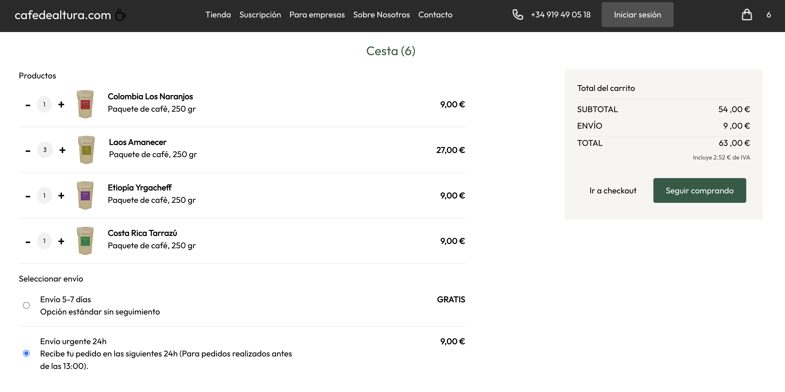

# Coffee Shop ☕🛒  

A modern e-commerce web application for selling coffee and delivering it to your doorstep. Built with React, TailwindCSS, and Firebase, this app provides a seamless shopping experience for coffee lovers.  

## Features ✨  
- **Browse Products**: View a catalog of premium coffee options with beautiful images and detailed descriptions.  
- **Add to Cart**: Easily add your favorite coffee products to the shopping cart.  
- **Order and Delivery**: Place an order and get coffee delivered to your home.  
- **User Authentication**: Sign up and log in to manage orders securely.  
- **Real-Time Database**: Orders and inventory are synced in real time using Firebase.  

## How It Works ⚙️  
1. Browse the coffee catalog and select your desired products.  
2. Add items to your cart and review your selections.  
3. Log in or sign up to complete your purchase.  
4. Place your order and track its status in real time.  

## Tech Stack 🛠️  
- **Frontend**: React for building a dynamic UI.  
- **Styling**: TailwindCSS .  
- **Backend**: Firebase for authentication and real-time database.  

## Demo 🚀  
  
